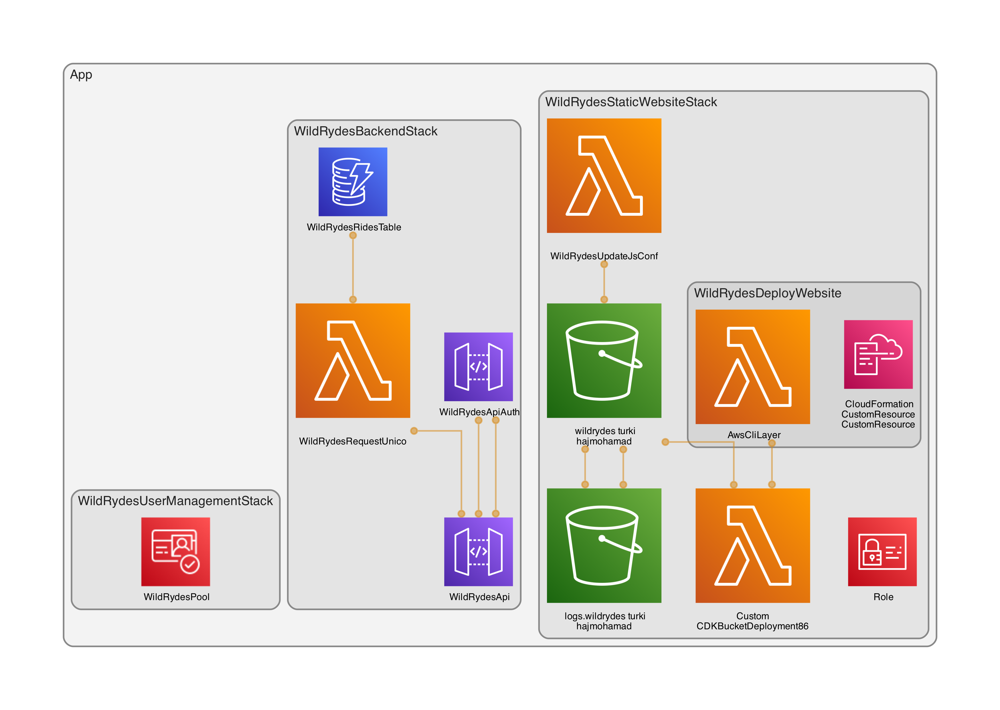

# wild-rydes

a serverless ride web application.

The application architecture uses AWS Lambda, Amazon API Gateway, Amazon DynamoDB, Amazon Cognito, and AWS S3

## Deployment

| Stack                        | AWS services        | Stack Dependencies           |
| ---------------------------- | ------------------- | ---------------------------- |
| WildRydesUserManagementStack | Cognito             | NA                           |
| WildRydesBackendStack        | API Gateway/ Lambda | WildRydesUserManagementStack |
| WildRydesStaticWebsiteStack  | S3/ Lambda          | WildRydesBackendStack        |

- deploy all stacks `cdk deploy --all --profile=foothill`
- destroy all stacks `cdk destroy --all --profile=foothill`
- deploy <specific-stack> a specific stack `cdk deploy '<specific-stack>' --profile=foothill`

## Test

- to run test `npm test`
- to regenerate a cdk template `npm test -- -u`

## Generate aws diagram using cdk-dia

- https://github.com/pistazie/cdk-dia
- make sure graphviz is installed `dot -V` if not `brew install graphviz`
- `npm install cdk-dia`

- to generate the diagram:
  - `cdk synth`
  - `npx cdk-dia`

